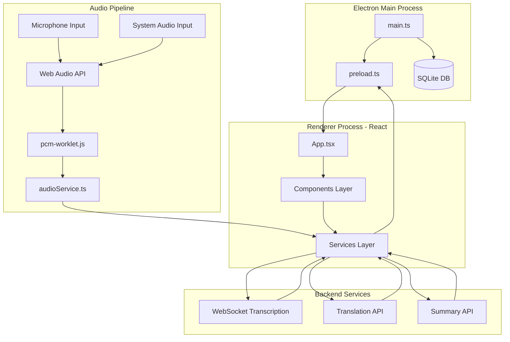
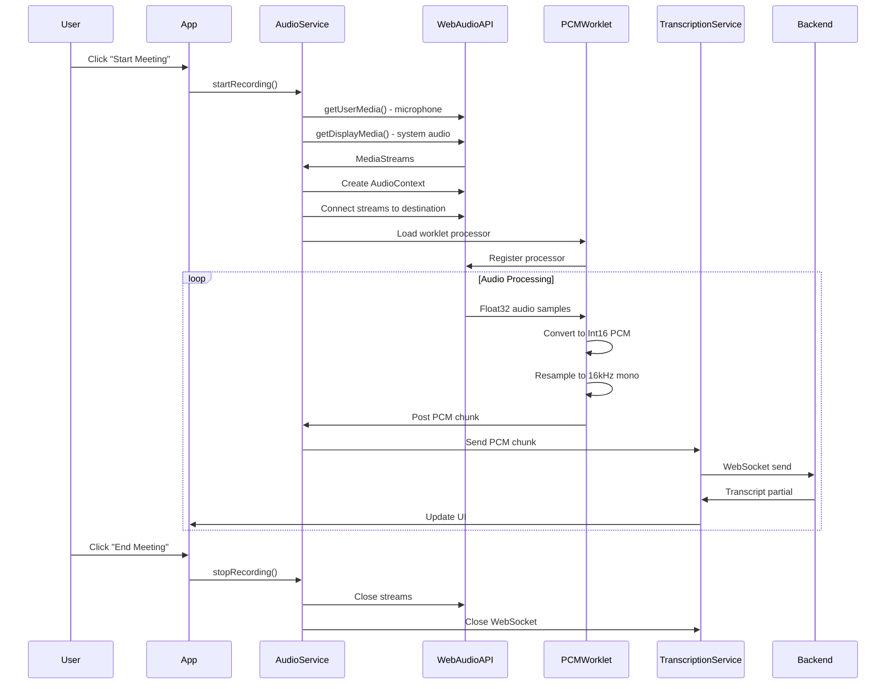
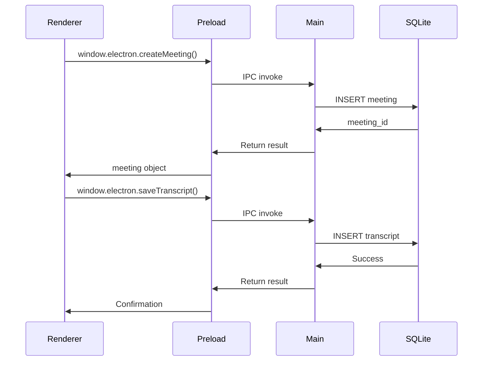
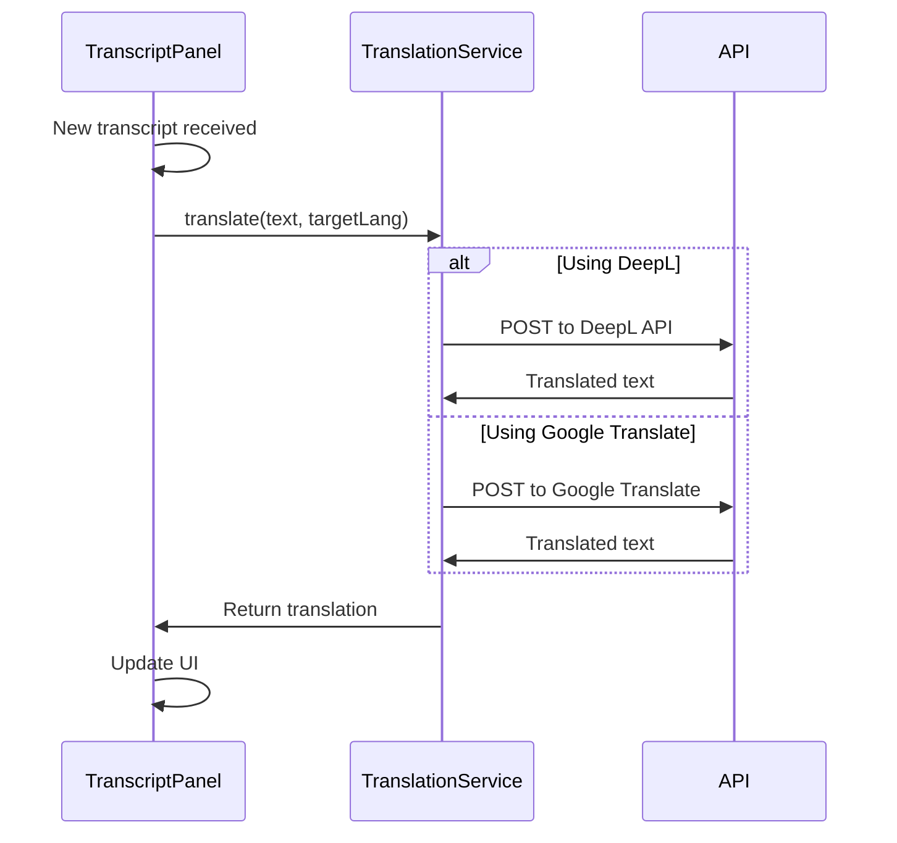

# MeetLens Architecture

This document describes the technical architecture, technology stack, and design patterns used in MeetLens.

## Overview

MeetLens is a cross-platform desktop application built with Electron, React, and TypeScript. It captures real-time audio from microphone and system sources, transcribes speech using AI services, and provides live translation capabilities.

## Technology Stack

### Core Framework
- **Electron** - Desktop application framework providing native OS integration
- **React 18** - UI framework for building the renderer interface
- **TypeScript** - Type-safe development across all modules
- **Vite** - Fast build tool and development server

### Audio Processing
- **Web Audio API** - Browser-native audio capture and mixing
- **AudioWorklet** - High-performance audio processing in dedicated thread
- **PCM Audio Processing** - Custom worklet for 16kHz mono PCM conversion

### Data & State
- **better-sqlite3** - Embedded SQLite database for meetings and transcripts
- **React Hooks** - State management (useState, useEffect, useRef)
- **WebSocket** - Real-time bidirectional communication with backend

### AI Services
- **Custom Transcription Service** - High-quality speech-to-text via WebSocket backend
- **DeepL API** - Real-time translation service (handled by backend)
- **AI Summarization** - Structured meeting summaries via backend service

### Development Tools
- **Vitest** - Fast unit testing framework
- **React Testing Library** - Component testing utilities
- **ESLint** - Code linting and style enforcement
- **electron-builder** - Multi-platform packaging and distribution

## Project Structure

```
meetlens-electron-app/
├── electron/                    # Electron main process
│   ├── main.ts                 # Main process entry point
│   ├── preload.ts              # Preload script for IPC bridge
│   ├── types.d.ts              # Electron type definitions
│   ├── main.test.ts            # Main process tests
│   └── preload.test.ts         # Preload tests
│
├── src/                        # React renderer process
│   ├── components/             # React UI components
│   │   ├── Sidebar.tsx        # Meeting list sidebar
│   │   ├── TopBar.tsx         # Application header
│   │   ├── TranscriptPanel.tsx # Real-time transcript display
│   │   ├── TranslationPanel.tsx # Translation output
│   │   └── SummaryPanel.tsx   # Meeting summary view
│   │
│   ├── services/               # Business logic layer
│   │   ├── audioService.ts    # Audio capture and mixing
│   │   ├── backendTranscriptionService.ts # WebSocket transcription
│   │   ├── backendSummaryService.ts # Meeting summarization
│   │   └── translationService.ts # Translation API integration
│   │
│   ├── types/                  # TypeScript definitions
│   │   └── electron.d.ts      # Renderer-side Electron types
│   │
│   ├── worklets/               # Audio worklet processors
│   │   └── pcm-worklet.js     # PCM audio conversion worklet
│   │
│   ├── test/                   # Test configuration
│   │   └── setupTests.ts      # Vitest setup
│   │
│   ├── App.tsx                 # Root React component
│   ├── main.tsx                # React entry point
│   ├── index.css               # Global styles
│   ├── config.ts               # Application configuration
│   └── vite-env.d.ts           # Vite type definitions
│
├── docs/                       # Documentation
│   ├── README.md               # Documentation index
│   ├── GETTING_STARTED.md      # Setup guide
│   ├── ARCHITECTURE.md         # This file
│   ├── TROUBLESHOOTING.md      # Troubleshooting guide
│   ├── SYSTEM_AUDIO.md         # macOS audio setup
│   ├── TESTING.md              # Testing guide
│   └── DLS.md                  # Design system
│
├── dist/                       # Build output (generated)
│   ├── main.js                 # Compiled main process
│   └── renderer/               # Compiled React app
│
├── package.json                # Project metadata and scripts
├── tsconfig.json               # TypeScript config (renderer)
├── tsconfig.main.json          # TypeScript config (main)
├── tsconfig.node.json          # TypeScript config (build tools)
├── vite.config.ts              # Vite configuration
├── electron-builder.json       # Electron packaging config
└── README.md                   # Quick start guide
```

## Architecture Diagram



## Module Organization

### Electron Main Process (`electron/`)

**Responsibilities:**
- Window lifecycle management
- Native OS integrations (menus, notifications)
- Database operations (SQLite)
- IPC (Inter-Process Communication) handlers
- System audio capture setup (macOS loopback)

**Key Files:**

- **`main.ts`** - Main process entry point
  - Creates browser window
  - Configures display media handler for loopback audio
  - Sets up database connection
  - Enables feature flags (MacLoopbackAudioForScreenShare)

- **`preload.ts`** - IPC bridge between main and renderer
  - Exposes safe APIs to renderer via `contextBridge`
  - Wraps database operations
  - Provides typed interface for renderer

### React Renderer (`src/`)

**Responsibilities:**
- User interface rendering
- User interactions and events
- State management
- Audio capture orchestration
- Real-time data display

### Components Layer (`src/components/`)

Pure UI components following React best practices:

- **`TopBar.tsx`** - Application header with settings
- **`Sidebar.tsx`** - Meeting list navigation
- **`TranscriptPanel.tsx`** - Real-time transcript display with auto-scroll
- **`TranslationPanel.tsx`** - Translated text output
- **`SummaryPanel.tsx`** - AI-generated meeting summary

Components receive data via props and emit events via callbacks.

### Services Layer (`src/services/`)

Business logic and external integrations:

- **`audioService.ts`** - Audio capture orchestration
  - Captures microphone via `getUserMedia()`
  - Captures system audio via `getDisplayMedia()`
  - Mixes streams using Web Audio API
  - Converts to PCM format using AudioWorklet
  - Exports audio state and controls

- **`backendTranscriptionService.ts`** - WebSocket transcription
  - Maintains WebSocket connection to production backend
  - Streams PCM audio chunks
  - Receives real-time transcription and translation results
  - Handles connection lifecycle and errors

- **`backendSummaryService.ts`** - Meeting summarization
  - Sends full transcript to backend
  - Receives structured AI-generated summary (Overview, Key Points, Action Items)
  - Handles summary formatting for display

### Audio Worklet (`src/worklets/`)

- **`pcm-worklet.js`** - High-performance audio processor
  - Runs in separate audio thread (AudioWorklet)
  - Converts Float32 audio to Int16 PCM
  - Resamples to 16kHz mono
  - Buffers and sends audio chunks
  - Calculates RMS and peak values for monitoring

## Data Flow

### Audio Capture Flow



### Database Operations Flow



### Translation Flow



## Audio Pipeline Architecture

### System Audio Capture (macOS)

MeetLens uses Electron's display media handler to capture system audio:

```javascript
// electron/main.ts
app.commandLine.appendSwitch('enable-features', 'MacLoopbackAudioForScreenShare');

session.defaultSession.setDisplayMediaRequestHandler((request, callback) => {
  desktopCapturer.getSources({ types: ['screen'] }).then((sources) => {
    callback({ video: sources[0], audio: 'loopback' });
  });
});
```

**Key Points:**
- `MacLoopbackAudioForScreenShare` feature flag enables loopback audio
- `audio: 'loopback'` provides system audio instead of screen microphone
- Only works in dev mode or signed apps on macOS Sequoia
- See [SYSTEM_AUDIO.md](SYSTEM_AUDIO.md) for details

### Audio Format Specifications

**Input Format:**
- Source: Float32Array from Web Audio API
- Sample rate: 48kHz (typical) or device native
- Channels: Stereo (2 channels)

**Output Format (PCM):**
- Format: 16-bit signed little-endian PCM
- Sample rate: 16kHz (resampled)
- Channels: Mono (1 channel)
- Encoding: `pcm_s16le_16k_mono`

**Conversion Pipeline:**
1. Mix stereo to mono (average channels)
2. Downsample from 48kHz to 16kHz
3. Convert Float32 (-1.0 to 1.0) to Int16 (-32768 to 32767)
4. Buffer into chunks for network transmission

### AudioWorklet Implementation

```javascript
// src/worklets/pcm-worklet.js
class PCMProcessor extends AudioWorkletProcessor {
  process(inputs, outputs, parameters) {
    const input = inputs[0];
    if (!input || !input[0]) return true;
    
    // Mix stereo to mono
    const mono = this.mixToMono(input);
    
    // Resample to 16kHz
    const resampled = this.resample(mono, currentSampleRate, 16000);
    
    // Convert to Int16 PCM
    const pcm = this.floatToPCM(resampled);
    
    // Send to main thread
    this.port.postMessage({ pcm, rms, peak });
    
    return true;
  }
}
```

## WebSocket Protocol

### Transcription WebSocket

**Endpoint:** `ws://localhost:8000/transcribe` (local) or `wss://domain/transcribe` (production)

**Message Types:**

**Client → Server:**
```json
{
  "type": "audio_chunk",
  "data": "<base64-encoded PCM>",
  "format": "pcm_s16le_16k_mono"
}
```

**Server → Client:**
```json
{
  "type": "transcript_partial",
  "text": "Hello world",
  "is_final": false,
  "timestamp": 1234567890
}
```

**Server → Client (Final):**
```json
{
  "type": "transcript_final",
  "text": "Hello world.",
  "is_final": true,
  "timestamp": 1234567890
}
```

### Connection Lifecycle

1. **Connect:** Client opens WebSocket connection
2. **Declare Format:** Send audio format specification
3. **Stream Audio:** Send PCM chunks continuously
4. **Receive Transcripts:** Process incoming transcript messages
5. **Disconnect:** Close connection on meeting end

## Database Schema

### SQLite Tables

**meetings table:**
```sql
CREATE TABLE meetings (
  id INTEGER PRIMARY KEY AUTOINCREMENT,
  name TEXT NOT NULL,
  created_at TEXT NOT NULL,
  updated_at TEXT NOT NULL,
  summary TEXT,
  full_transcript TEXT
);
```

**transcripts table:**
```sql
CREATE TABLE transcripts (
  id INTEGER PRIMARY KEY AUTOINCREMENT,
  meeting_id INTEGER NOT NULL,
  timestamp TEXT NOT NULL,
  text TEXT NOT NULL,
  translation TEXT,
  FOREIGN KEY (meeting_id) REFERENCES meetings(id) ON DELETE CASCADE
);
```

## Build System

### Development Build

```bash
npm run dev
```

**Process:**
1. `tsc -p tsconfig.main.json` → Compile Electron main to `dist/main.js`
2. `vite` → Start dev server on port 5173
3. Wait for Vite ready
4. `electron dist/main.js` → Launch Electron with DevTools

### Production Build

```bash
npm run build
```

**Process:**
1. `vite build` → Bundle React app to `dist/renderer/`
2. `tsc -p tsconfig.main.json` → Compile Electron main to `dist/main.js`

### Packaging

```bash
npm run package
```

**Process:**
1. Run production build
2. `electron-builder` creates installers:
   - macOS: `.dmg` (x64 and arm64)
   - Windows: `.exe` installers
   - Linux: `.AppImage` and `.deb` packages

## Configuration Files

- **`package.json`** - Project metadata, dependencies, npm scripts
- **`tsconfig.json`** - TypeScript config for renderer
- **`tsconfig.main.json`** - TypeScript config for main process
- **`vite.config.ts`** - Vite build configuration
- **`electron-builder.json`** - Packaging configuration
- **`src/config.ts`** - Runtime application configuration

## Testing Strategy

See [TESTING.md](TESTING.md) for complete testing documentation.

**Test Frameworks:**
- **Vitest** - Unit testing framework
- **React Testing Library** - Component testing
- **jsdom** - Simulated browser environment for renderer tests
- **Node environment** - Native environment for main/preload tests

**Test Organization:**
- Tests are colocated with source files (`.test.ts`, `.test.tsx`)
- Mock Electron APIs in tests
- Use `src/test/setupTests.ts` for global test configuration

## Performance Considerations

### Audio Processing
- AudioWorklet runs in dedicated high-priority thread
- Prevents main thread blocking during audio processing
- Buffers audio chunks to reduce WebSocket overhead

### React Rendering
- Use `React.memo()` for expensive components
- Virtualize long transcript lists for performance
- Debounce translation requests

### Database Operations
- Use prepared statements for repeated queries
- Index frequently queried columns
- Run database operations in main process (off renderer thread)

## Security Considerations

### API Keys
- Handled securely by the backend services
- No user-provided API keys required in the desktop application

### Electron Security
- Context isolation enabled
- Node integration disabled in renderer
- Use `contextBridge` for safe IPC
- Validate all IPC messages

### Content Security Policy
- Restrict resource loading
- Disable inline scripts in production
- Use nonces for script tags

## Platform-Specific Notes

### macOS
- System audio requires app signing or BlackHole driver
- Screen Recording permission required for `getDisplayMedia()`
- Universal builds support both Intel and Apple Silicon

### Windows
- Microphone permissions via Windows Privacy Settings
- No special audio routing needed

### Linux
- Permissions vary by distribution
- PulseAudio or PipeWire required for audio capture
- AppImage provides universal distribution format

## Future Architecture Considerations

### Potential Improvements
- Offline transcription using local Whisper model
- Multi-track audio recording (separate speaker tracks)
- Real-time speaker diarization
- WebRTC for remote participant audio
- End-to-end encryption for sensitive meetings
- Cloud sync for meeting history

## Additional Resources

- **Getting Started:** [GETTING_STARTED.md](GETTING_STARTED.md)
- **Troubleshooting:** [TROUBLESHOOTING.md](TROUBLESHOOTING.md)
- **System Audio:** [SYSTEM_AUDIO.md](SYSTEM_AUDIO.md)
- **Repository Guidelines:** [../AGENTS.md](../AGENTS.md)
- **Design System:** [DLS.md](DLS.md)
